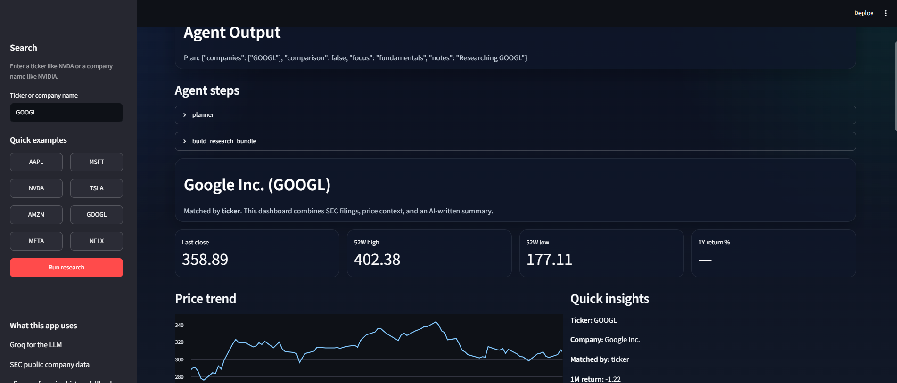
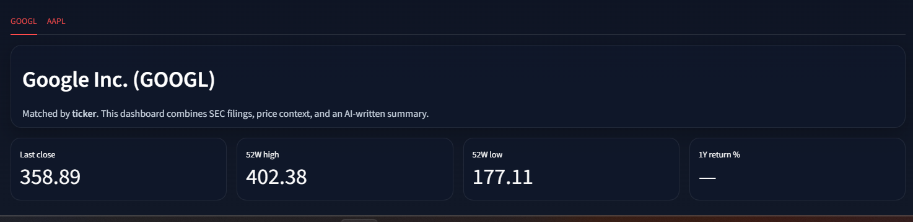

# 📈 AI Stock Research Agent

An AI-powered stock research application built with **Streamlit**, **Groq LLMs**, **SEC EDGAR**, and **Yahoo Finance**.

## ✨ Features
- 🤖 AI research planning using Groq
- 📊 Company lookup by ticker or name
- 📑 SEC filings and Company Facts
- 💹 Price history and return statistics
- 📝 AI-generated research reports
- 🔍 Single-company and two-company comparisons

## 🚀 Setup
1. Clone the repository.
2. Install dependencies:
```bash
pip install -r requirements.txt
```
3. Copy `.env.example` to `.env`.
4. Create a Groq API key at https://console.groq.com.
5. Add:
```env
GROQ_API_KEY=your_key
GROQ_MODEL=llama-3.3-70b-versatile
SEC_USER_AGENT=Your Name your@email.com
```
6. Run:
```bash
streamlit run App.py
```

## 🧠 Architecture
App.py → agent.py → Stock_Agent.py

## ⚙️ Model
Default model: `llama-3.3-70b-versatile`.
You may switch to another Groq-supported model by changing `GROQ_MODEL`.






## ⚠️ Limitations
- Relies on public SEC and Yahoo Finance data.
- No real-time market feed.
- Company matching is heuristic.
- Supports up to two companies.
- LLM responses can vary slightly between runs.
- Research only, not financial advice.

## 🔄 Trade-offs
- Better models improve quality but increase latency and API cost.
- Public data is free but less comprehensive than premium financial data.
- Deterministic workflow reduces hallucinations but limits flexibility.

## 📌 Future Improvements
- News integration
- Multi-agent workflow
- PDF export
- Portfolio analysis
- Earnings transcript analysis

## ⚖️ Disclaimer
Educational and research purposes only. Always perform your own due diligence before making investment decisions.

⭐ If you like this project, consider starring the repository!
